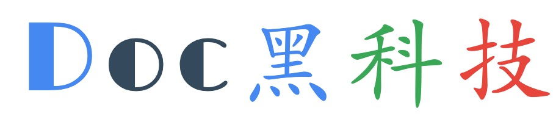

<a name="stack"></a>
## 主要技术栈

<a name="be"></a>
### 后端

Go语言框架[Beego](https://beego.me)

<a name="fe"></a>
### 前端

基于Bootstrap的前端框架[Flat-UI](https://github.com/designmodo/Flat-UI)

<a name="db"></a>
### 数据库

MySQL，数据存储

<a name="env"></a>
### 依赖环境

<a name="office"></a>
#### Libreoffice(或Openoffice)

用于将office文档转PDF

使用命令:
```
soffice --headless --invisible --convert-to pdf path/to/officefile --outdir path/to/outdir
```

<a name="pdf2svg"></a>
#### pdf2svg

> 注意，这个要用最新版的`pdf2svg`

pdf2svg，用于将PDF转成svg矢量图片，以供阅读。

使用命令：
```
pdf2svg <in file.pdf> <out file.svg> [<page no>]
```

<a name="calibre"></a>
#### calibre

用于将`mobi`、`chm`、`epub`等文档转成PDF，然后再将`pdf`转成`svg`

> 注意：目前`mobi`、`epub`等文档的在线阅读功能还没有实现

<a name="oss"></a>
#### 阿里云OSS
存储office文档、PDF文档以及svg等文件

> 注意：目前只支持阿里云的OSS云存储，暂时不支持其他云存储(后期我再抽时间开发和扩展其他云存储)，不支持本地化存储(现在云存储和CDN价钱比以前便宜多了)

<a name="feature"></a>
## 功能特点

<a name="read-svg"></a>
### 文档在线阅读
`DocHkj`文库通过`svg`矢量图来实现文档阅读体验的，我知道的文库站点中，[新浪爱问](http://ishare.iask.sina.com.cn/)是通过`png`等图片提供文档阅读体验的。

`SVG`相比`png`、`jpeg`等图片格式有很大的优势，至少放大不会失真，而且与JPEG 和 GIF 图像比起来，svg尺寸更小，可压缩性更强，`DocHub`通过gzip，将svg文件压缩，一般情况下，能减少70%的文件大小，比如200kb的svg，gzip压缩后，只有60kb左右的大小。

使用svg，大大提升了加载速度，优化了内容的阅读体验。

<a name="read-office"></a>
#### office文档在线阅读

这个需要经过两层转化:
```
office --> pdf --> svg
```

> 之前有考虑过office文档不经过转化，然后直接在线浏览的，但是方案比较复杂，部署不容易，至少我没部署成功过...

<a name="read-pdf"></a>
#### PDF文档在线阅读

将PDF文档通过`pdf2svg`转化，提供在线阅读

> 没有使用mozila的`pdf.js`作为PDF文档阅读的实现方案，主要是我没有解决`pdf.js`分片分页加载的问题，每次都需要将整个PDF文档下载下来才能提供阅读。如果文档大的话，用户需要等待好长时间，而且也比较耗费服务器带宽资源。

<a name="read-other"></a>
#### mobi、epub、chm文档在线阅读
使用`calibre`将文档转成PDF，然后pdf再转svg。

> 目前该功能还没实现，epub、mobi等文档，现在还是暂时不能在线阅读


<a name="score"></a>
### 积分功能
用户签到、上传分享文档，获得积分奖励；用户下载文档，需要消耗积分

<a name="watermark"></a>
### 阅读文档水印功能
在提供阅读的svg文件上添加水印

